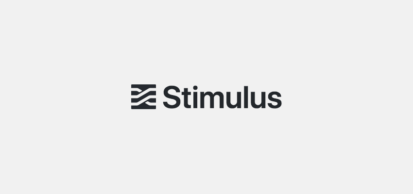
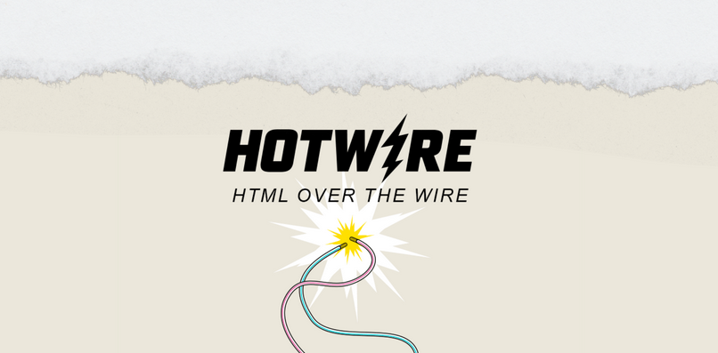
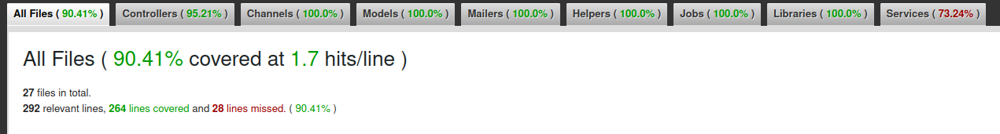

# E-Commerce Project

## Contributing

While this project is primarily for my personal development, I'm open to contributions, suggestions, and discussions on different solutions to these problems. Feel free to open an issue or a pull request if you have any inputs or corrections.

## License
[MIT License](https://opensource.org/licenses/MIT)


# Web Technologies

In addition to Ruby on Rails and the gems listed above, this project utilizes several modern web technologies to enhance interactivity and style:

<p>
  
</p>
- **[Tailwind CSS](https://tailwindcss.com/docs)**: A utility-first CSS framework for rapidly building custom user interfaces. Tailwind provides low-level utility classes that help you build completely custom designs without ever leaving your HTML.

<p>
  
</p>
- **[Stimulus](https://stimulus.hotwired.dev/)**: A modest JavaScript framework for the HTML you already have. Stimulus is designed to augment your HTML by bringing functionality to the web with just a little bit of JavaScript.

<p>
  
</p>
- **[Turbo](https://turbo.hotwired.dev/)**: Part of the Hotwire suite, Turbo uses techniques from TurboLinks and expands upon them to offer fast navigation and interactions without the need for full page reloads. It allows Rails to deliver fast, rich, interactive applications.

<p>
  
</p>
- **[Hotwire](https://hotwired.dev/)**: An alternative approach to building modern web applications without using much JavaScript by sending HTML instead of JSON over the wire. This makes for faster page loads and re-renders.


# Key Gems Used

- **[Simplecov](https://github.com/simplecov-ruby/simplecov)**

To run a report use:
```bash
COVERAGE=true bundle exec rspec
```
The image below is just an example and won't be updated in a regular manner


- **[Devise](https://github.com/heartcombo/devise)**:Devise is a flexible authentication solution for Rails based on Warden. It provides a robust set of features including database authenticatable, registrable, confirmable, recoverable, trackable, and omniauthable which are designed to make authentication a streamlined and secure process for web applications.

- **[Font Awesome Sass](https://github.com/FortAwesome/font-awesome-sass)**:This gem integrates Font Awesome icons into your Rails applications using the Sass version of Font Awesome, offering an easy-to-use set of icon styles that can be customized with Sass variables. It's perfect for Rails developers who want to include scalable icons that can be styled on the fly with CSS.

- **[Stripe](https://stripe.com/docs/api)**:Stripe provides powerful and flexible APIs for integrating payment processing into your applications. The `stripe` gem simplifies the process of handling transactions, subscriptions, and other financial operations directly from your Rails application, making it essential for e-commerce solutions.

- **[Pagy](https://ddnexus.github.io/pagy/)**:Pagy is an efficient pagination library that outperforms the more commonly used will_paginate and kaminari gems. It is designed for performance and memory efficiency, helping you manage large sets of data with minimal overhead.

- **[FactoryBotRails](https://github.com/thoughtbot/factory_bot_rails)**: A fixtures replacement tool that makes it easy to create object instances for testing purposes. It integrates seamlessly with RSpec to make testing Rails applications much simpler.
